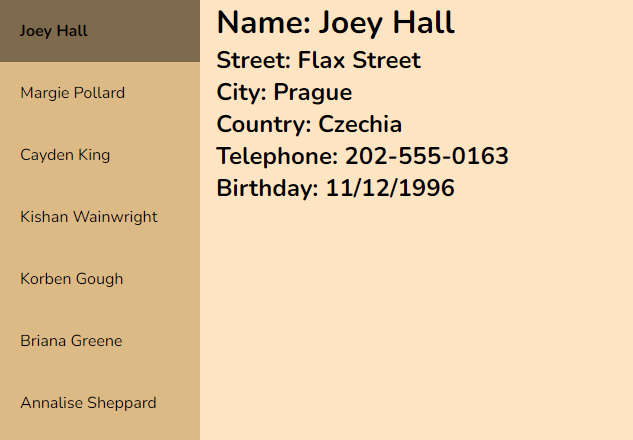

# Cause Effect App
Cause Effect App, feito para o desafio do [AppIdeas](https://github.com/florinpop17/app-ideas). Veja uma [demo aqui](https://codepen.io/gustavoaqm/pen/WNMvgwe).

Os padrões são parte integrante da engenharia de software e representam
componentes reutilizáveis na lógica do programa. No entanto, os padrões não são usados apenas
para lógica de programa, eles existem em outros domínios, como DevOps, suporte ao usuário e a interface do usuário.

Um padrão de interface de usuário comum é resumir dados em uma seção de uma página
que consiste em algum tipo de lista (como texto, imagens ou ícones) que descreve
ou categoriza um conjunto de dados. Quando um item da lista é clicado, os dados detalhados
atrás dele é exibido em um painel adjacente na página.

Por exemplo, em um site imobiliário, clicar em um endereço em uma lista de propriedades
para venda exibe os detalhes sobre a propriedade em outra parte do
página.

Este desafio requer que o desenvolvedor que o implementa siga estas
restrições:

-    Você é responsável por criar seus próprios dados de teste. Use um código fixo
    Objeto Javascript para definir seus dados de teste.
-    Use apenas HTML/CSS/Javascript nativo em sua primeira versão deste aplicativo
-    Você pode usar outros pacotes ou bibliotecas ao implementar
    versões.

##  Regras

-    [x] O usuário pode ver uma lista de nomes de pessoas organizados verticalmente em um resumo
        painel na página.
-    [x] O usuário pode clicar em um nome na lista para atualizar um painel adjacente na
        página com o nome completo, endereço, número de telefone e
        aniversário.
-    [x] O usuário pode clicar em outro nome na lista para atualizar o painel de detalhes
        com essas informações individuais.

##  Recursos de bônus

-    [x] O usuário pode ver o nome da pessoa no painel de resumo realçado quando o
        cursor passa sobre ele.
-    [x] O usuário pode ver o nome da pessoa no painel de resumo destacado
        usando um efeito de seleção (cor, tamanho, etc.) quando clicado. Isto é um
        efeito diferente do efeito hover
-    [x] O usuário pode ver o efeito de seleção removido de um nome no resumo
        lista quando um novo nome é clicado.
